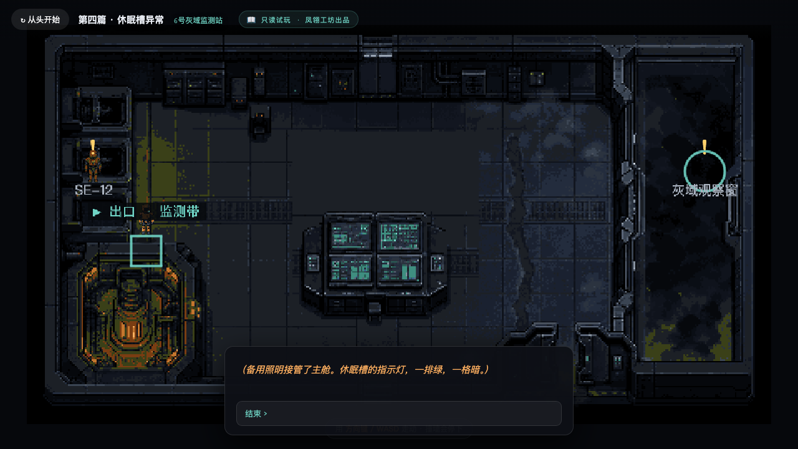
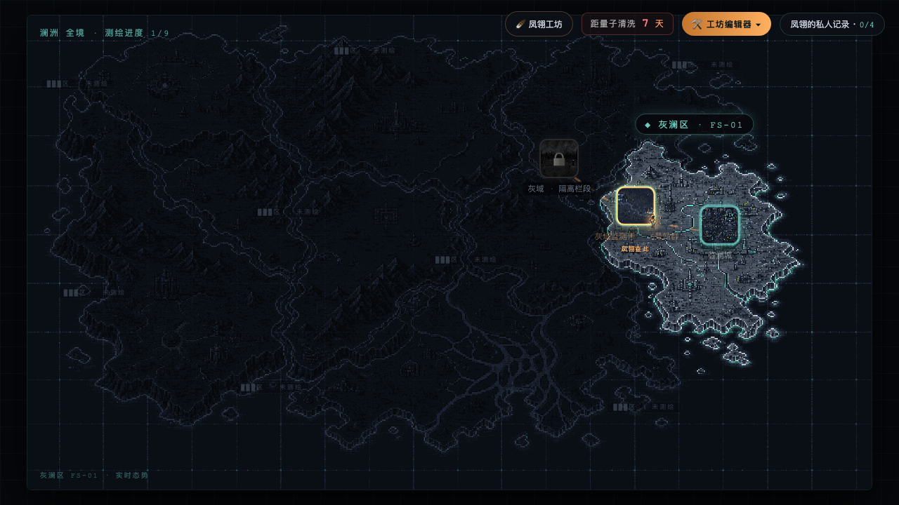
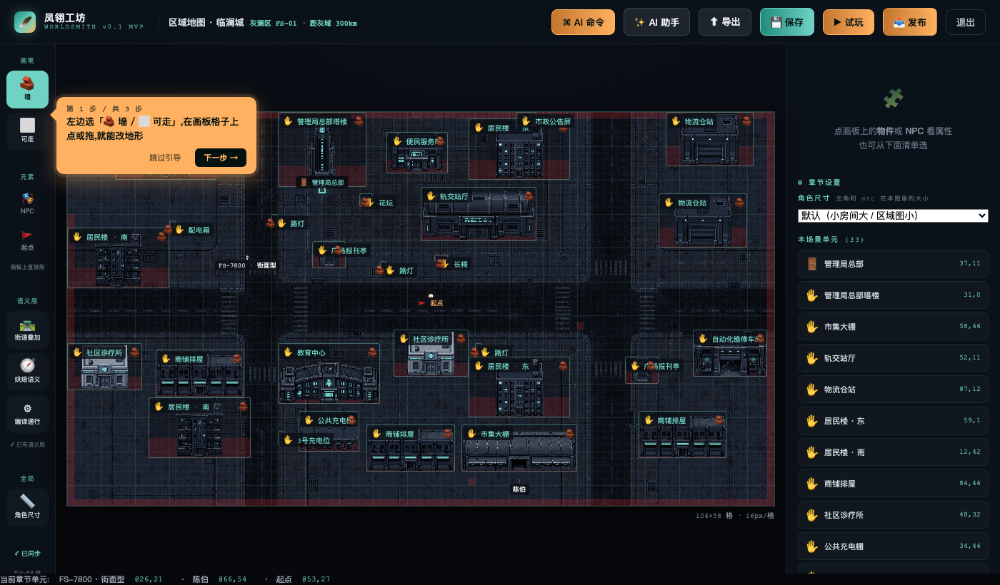

# 凤翎工坊 · WORLDSMITH

> 把小说变成能走进去的像素世界 —— 一个可交互叙事 demo ＋ 面向创作者的世界可视化编辑器。



**[在线试玩《07 号调查员》](https://roam-bit.github.io/fengling-workshop/index.html?play=project)** · 手机可直接打开（建议横屏）；想试编辑器请用电脑。

## ✨ 这是什么

两层东西，住在同一个仓库里：

- **《07 号调查员》** —— 一个可交互的 2D 俯视像素叙事 demo。2095 年，AI 协同文明 ＋ SCP 风「异常区域」。走进去、和 NPC 对话、收集线索、解锁后续篇章。克制、悬疑、档案体。
- **凤翎工坊编辑器** —— 做出这个 demo 用的、面向创作者的世界可视化编辑器。地图、NPC、交互事件、玩法机制全部可视化配置，还能**用自然语言命令编辑器**。

参考了 [LDtk](https://ldtk.io/) / [Tiled](https://www.mapeditor.org/) 关卡编辑器的思路，但目标是「不懂编程也能用」。**纯前端 ＋ 轻量 Python server，无构建步骤、无 npm，clone 下来就能跑。**

## 🎮 快速开始

**前置要求只有一个：Python 3.8+**（macOS 自带，Windows 从 [python.org](https://www.python.org/downloads/) 或微软商店免费装）。不需要 pip 装任何东西，不需要 node/npm。

```bash
git clone https://github.com/roam-bit/fengling-workshop.git
cd fengling-workshop
python3 server.py            # 启动本地 server（端口 8131，仅用 Python 标准库，零依赖不用 pip）
```

然后浏览器打开 **http://127.0.0.1:8131**。

> 没装 git？直接点仓库页面的 **Code → Download ZIP**，解压后进入目录跑 `python3 server.py` 一样用。
> macOS 也可以直接双击 `启动凤翎工坊.command`（ZIP 解压的用户若双击无效，用上面的命令行方式）；Windows 用 `python server.py`。

- **只想看 demo？** 进去就是世界地图，点亮的区域走进去玩。
- **想试编辑器？** 打开 `http://localhost:8131/index.html?edit=area_city`。

## 🧩 核心特性

### 可交互探索（玩家侧）



- **澜洲大陆世界图**：纯 DOM 高清 HUD ＋ 塞尔达式战雾，小说写到哪、地图亮到哪
- **Phaser 像素房间**：键盘移动或点击 BFS 自动寻路 ＋ 撞墙碰撞 ＋ 走近 NPC 对话 ＋ 镜头跟随 ＋ y-sort 遮挡
- **NPC 系统**：行为枚举（静止 / 游走 / 巡逻）＋ 条件对话页（"它记得你来过"）
- **触发器 ＋ 指令解释器**：走近 / 进入 / 离开 / 自动触发 × 9 种指令积木（旁白 / 分支 / 设标志 / 条件判断 / 记线索 / 给道具 / 传送 / 特效 / 等待）
- **玩法机制**：调查日志（线索渐进解锁）＋ 叙事道具（找钥匙开门闭环）

### 傻瓜式编辑器（创作者侧）



- **可视化拖拽**：建筑 / 物件 / NPC / 传送门所见即所得，NPC 行为·对话·道具·触发器全部表单配置
- **⌘ AI 命令层**：对编辑器**说人话** —— 「把市集大棚放到管理局总部附近」「让陈伯巡逻」，系统自动搜合法位、避免压街、保证连通性
- **语义层**：街道 / 地形是「原始事实」，碰撞层是「编译产物」—— 从根上消灭「楼压街 / 空气墙」类问题
- **一键发布**：发布前自动校验（出生点可达 / 出口连通 / 数据完整），通过即生成**只读分享链接**，读者零安装打开就玩

## 🏗️ 技术架构

| 层 | 技术 | 说明 |
|---|---|---|
| 世界地图 | 纯 DOM | 高清矢量 HUD ＋ 渐进战雾 |
| 游戏房间 | Phaser 3 | 网格移动 / 碰撞 / y-sort / 镜头跟随 |
| 数据 | `chapters.json` | 单一数据源：篇 / 房间 / NPC / 对话 / 触发器 / 玩法 / 语义层 |
| 后端 | `server.py`（Python 标准库） | 静态服务 ＋ `/api/save-chapter` ＋ `/api/command` |
| AI 命令层 | DeepSeek（可选）＋ 规则解析兜底 | 自然语言 → 意图级命令 |
| 美术管线 | Python ＋ Pillow | AI 生图 → 绿幕抠图 → 32 色量化 → 入库 |

**编辑器 UI 和 AI 命令层是同一套 `/api/command` 的两个客户端** —— 意图级命令（"放什么、在谁附近"），坐标搜索 / 合法性验证 / 碰撞编译全部归服务端，调用方不碰坐标。

## 🤖 AI 命令层（可选配置）

编辑器的「⌘ AI 命令」能听懂自然语言。接 DeepSeek 后能听懂任意说法（"安排到那一带""原地待命""搁…边上"都行），不接也有**内置规则解析器兜底**（听得懂固定句式）。

```bash
cp .ai_key.example .ai_key
# 把 .ai_key 内容换成你的 DeepSeek API key（https://platform.deepseek.com/）
# 可选：在 .ai_model 里写模型名，默认 deepseek-v4-flash
```

> 不配 key 也能用 —— AI 命令会自动降级到规则解析，功能不中断。

## 🧪 测试

```bash
python3 test/e2e_smoke.py     # 200+ 项端到端确定性检查（需先起 server）
```

用 headless Chrome ＋ Python 对真实 server 做确定性验证，覆盖：数据完整性 / 碰撞连通（BFS）/ 拖拽存盘往返 / AI 命令落盘 / 语义编译 / 发布门 / 读者模式等全链路。

## 📁 项目结构

```
index.html          主程序（游戏 ＋ 编辑器，单文件）
server.py           本地 server ＋ API
chapters.json       游戏数据（单一数据源）
phaser.min.js       Phaser 引擎（本地化，离线可跑）
art/                美术管线（处理脚本 ＋ out/ 量化素材 ＋ 生图指南）
docs/               技术文档（三系统设计 / 美术生图规格卡）
test/e2e_smoke.py   E2E 冒烟测试（200+ 项）
AGENTS.md           给 AI 编程工具的项目地图（用 Codex / Claude Code 改这个项目前先读它）
启动凤翎工坊.command   macOS 一键启动器
```

## 🛠️ 想自己改它？（AI 编程友好）

这个项目就是全程 AI 辅助开发的，也为"被 AI 修改"做了准备：

- **改剧情 / 地图 / NPC / 对话 / 机制**：不用碰代码——打开编辑器（`?edit=章节id`）可视化改，或直接编辑 `chapters.json`（单一数据源）。
- **用 Codex / Claude Code / Cursor 改代码**：仓库根目录的 [`AGENTS.md`](AGENTS.md) 是给 AI 工具的项目地图（架构、改法配方、验证方式、已知坑），AI 会自动读取它。直接下命令即可，例如「给陈伯加一句台词」「做一个走近就触发旁白的机制」「加一个会巡逻的 NPC」。
  > 💡 **server 自己在终端跑着别关**（`python3 server.py` 是常驻进程），不要让 AI 代跑——它会一直卡在那等。改完前端刷新浏览器即可；改了 `server.py` 才需要重启。
- **改完怎么验证**：起 server 后跑 `python3 test/e2e_smoke.py`，200+ 项自动检查全绿即可放心。

## 📜 License

代码以 [MIT License](LICENSE) 开源。Phaser 引擎同为 MIT。

---

*《07 号调查员 / 凤翎》的世界观、剧情、美术设定为作者原创，仅作 demo 内容展示。*
